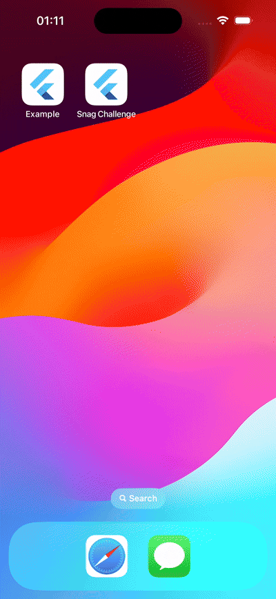

# 🏗️ TMDB Movie Viewer 

### ▶️ Demo Showcase



> [!NOTE]
> Project runs on flutter version 3.35.3

### 📚 Description

TMDB popular movie viewer. Fetching popular movies using TMDB's most popular movies
API.

### 🚧 Run/build application

Firstly, trigger build_runner build command to generate all dto codes

```shell
dart run build_runner build -d
```

To run this application, a TMDB_API_KEY to the flutter environment via dart-define. The following
command runs the application.

```shell
flutter run --dart-define=TMDB_API_KEY=#apiKey
```

Building an android apk

```shell
flutter build apk --dart-define=TMDB_API_KEY=#apiKey
```

### 🚧 Run test

Running the integration tests requires the patrol cli installed. Check [here](https://patrol.leancode.co/documentation) for the installation guide

Once the patrol cli is installed, running the test is simple and done with the following command

```shell
patrol test -t integration_test/scenarios_test.dart --dart-define=TMDB_API_KEY=#apiKey
```